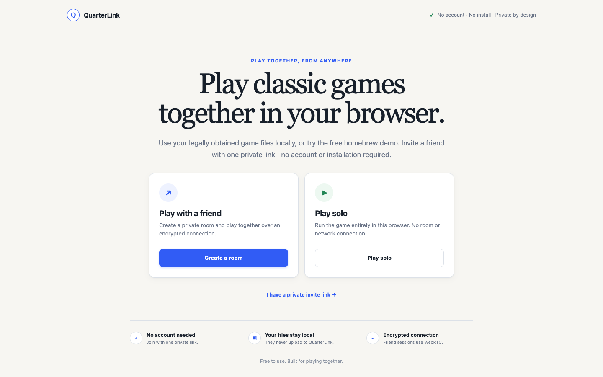
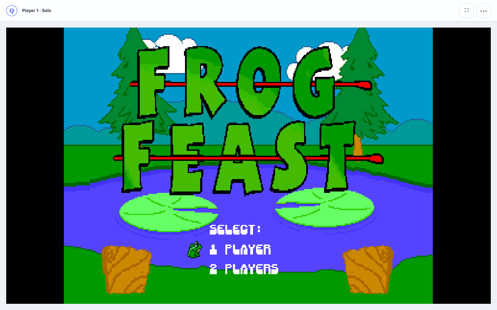

# QuarterLink

**Your couch has a second seat.** QuarterLink is a zero-install browser arcade for solo play or a private two-player session. A host can play locally, or open a room, share a single-use link, load local arcade files, and play with a friend over encrypted WebRTC.

**[Open the live app](https://quarterlink.okan.workers.dev/)** · **[CI](https://github.com/okturan/quarterlink/actions/workflows/ci.yml)**

[](https://quarterlink.okan.workers.dev/)

## Current playable path

- Solo mode runs the selected game entirely in the local browser without creating a room or network connection.
- Metal Slug 2 runs in the host browser using a pinned FBNeo WebAssembly core.
- The guest joins without an account or installation.
- Guest controller input travels directly to the host over an unordered WebRTC data channel.
- The authoritative game canvas and emulator audio stream directly back to the guest.
- Cloudflare Durable Objects coordinate single-use invites and WebRTC signaling only; gameplay does not travel through the Worker.
- The in-game HUD measures peer data-channel RTT and jitter rather than misleading API latency.

The host supplies `mslug2.zip` and `neogeo.zip` in the room. Files remain local and are never uploaded. QuarterLink does not contain or distribute game ROMs.

For hardware and connection testing without proprietary files, the room also offers Frog Feast, a freely distributable two-player CPS-1 homebrew game. Its source, transformation, hashes, and permission notice are recorded in [`public/demo/NOTICE.md`](public/demo/NOTICE.md).



Both screenshots are captured from the deployed app; the game view uses the documented, freely distributable Frog Feast fixture.

The July 2026 product redesign began from GPT-generated desktop and mobile direction boards. The saved references and design rationale are in [`docs/design`](docs/design).

## Run locally

```bash
npm ci
npm run dev
```

Open `http://localhost:8787` in current Chrome or Edge. Create a room, select both required ZIP files, then send the invite to a second browser profile/device.

## Verify

```bash
npm test
npm audit --audit-level=high
npm run check
npm run smoke:prod
```

`npm run check` regenerates Cloudflare binding types, type-checks the Worker, and performs a Wrangler deployment dry-run.

`npm run smoke:prod` exercises the deployed navigation shell, authenticated room creation, delayed guest signaling, bidirectional SDP forwarding, same-role socket replacement, guest removal, fresh invitation rotation, and replacement guest admission.

## Architecture

```text
Host browser ─── WebRTC video + input ─── Guest browser
      │                                      │
      └──── WebSocket signaling only ────────┘
                         │
            Cloudflare GameRoom Durable Object
```

Each room has its own SQLite-backed Durable Object, two seats, a 2-hour TTL, a hashed single-use invite, and HttpOnly room-scoped sessions. Invite secrets are placed in the URL fragment so browsers do not include them in HTTP requests, referrers, or server logs.

## Security and privacy

- `COOP`, `COEP`, and `CORP` enable an isolated Wasm runtime.
- A same-origin CSP blocks third-party scripts and network fallbacks; the pinned legacy Emscripten core is explicitly allowed its required `unsafe-eval` and in-memory `blob:` script, worker, and Wasm fetch paths. There is no analytics or ROM upload path.
- Cryptographic room IDs, sessions, and invite secrets.
- Signaling messages are allowlisted and bounded to 64 KiB.
- Durable Object WebSocket hibernation avoids always-on coordination instances.
- Room state returned to clients excludes session tokens and invite hashes.

## Runtime licensing

The browser runtime vendors EmulatorJS 4.2.3 under GPL-3.0 and both non-threaded FBNeo WebAssembly variants from the pinned `@emulatorjs/core-fbneo@4.2.3` package. Static tests verify their exact sizes and SHA-256 hashes so the runtime cannot silently drift to a CDN fallback. See [`public/vendor-licenses`](public/vendor-licenses). FBNeo is non-commercial software; QuarterLink must remain non-commercial unless a separate license is obtained. Commercial game ROMs and BIOS files are not included; the bundled Frog Feast test game is homebrew and documented in [`public/demo/NOTICE.md`](public/demo/NOTICE.md).

## Known production gates

- TURN credentials are not configured on the public deployment yet, so symmetric NAT/corporate networks may fail instead of relaying. The application is relay-ready and falls back to Cloudflare STUN when secrets are absent.
- The current product path is authoritative streaming, not GGPO rollback. Do not market it as rollback.
- Full device-matrix and real two-network gameplay QA must be completed with the host-provided game files before a stable release tag.

## Deployment

```bash
npx wrangler login
npm run deploy
```

The Worker uses static assets plus the `GAME_ROOMS` Durable Object binding defined in `wrangler.jsonc`.

For relay coverage, create a Cloudflare Realtime TURN key and store its key ID and token as Worker secrets named `TURN_KEY_ID` and `TURN_KEY_TOKEN`. Creating the key requires an API token with Account Realtime Calls write permission; never commit either value.
